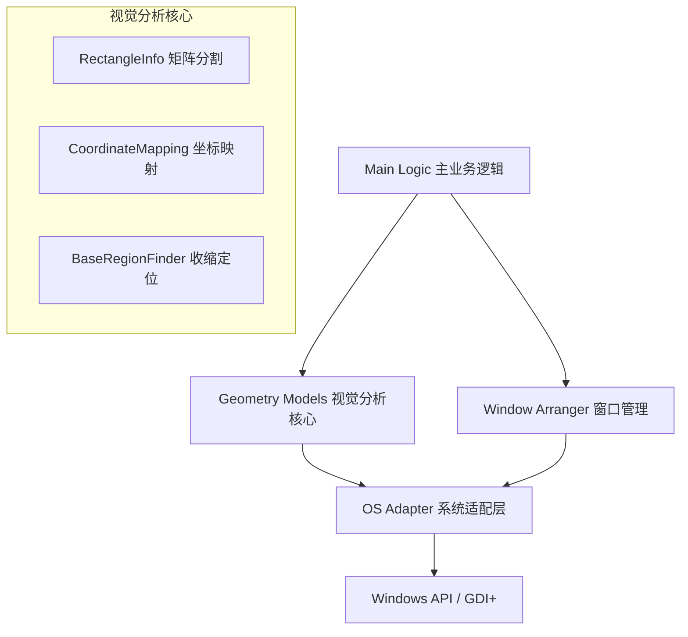

# Customized-Screenshots-OCR

> 基于 AutoHotkey v2 的高精度视觉自动化框架 —— 专为非标准 UI、动态布局及复杂业务场景设计。

  

> **⚠️ 特别提示**
> 
> 本框架并非简单的“录制-回放”工具，其核心配置大量涉及 **坐标系变换**、**矩阵切割** 及 **几何逻辑抽象**。
> 
> **此框架仅适合具备较强空间想象力与抽象思维能力的开发者使用。** 
> 
> 使用者需要在脑海中或草稿纸上构建多层 UI 的几何叠加关系，才能正确配置分割模数与坐标参数。如果您对“将屏幕区域映射为逻辑网格”这类的空间概念感到陌生，配置过程可能会极具挑战性。

## 📖 项目简介

**Customized-Screenshots-OCR** 是一套高度复杂且模块化的自动化解决方案，旨在解决 **没有 API 接口** 的目标应用程序自动化难题。

它不仅仅是一个简单的“找图点击”脚本，而是实现了一套完整的、自适应的 **视觉分析引擎**。通过精密的几何运算、多颜色逻辑分析和矩阵坐标映射，它能够在动态变化或非标准的 UI 界面（如游戏引擎渲染的界面、Qt/Electron 应用）中，实现像素级的精准定位与操作。

本项目展示了如何使用 **AutoHotkey v2** 的面向对象特性（OOP）构建一个健壮的、可维护的生产级自动化机器人。

## ✨ 核心特性

*   **🧩 高度模块化架构**：代码解耦为操作系统适配层、全局配置、窗口管理、几何模型与业务逻辑，易于维护和扩展。
*   **🖥️ 多窗口并行处理**：支持自动发现、排列并批量处理多个应用程序实例，每个窗口独立进行视觉分析。
*   **🎯 高级视觉定位引擎**：
    *   **矩阵坐标映射**：将 UI 分割为逻辑网格，即使列表/表格大小发生变化，也能通过映射算法定位目标单元格。
    *   **复合颜色逻辑**：支持多颜色交并集运算，排除背景干扰，精准锁定数据区域。
*   **🛡️ 健壮的底层封装**：内置 `OS Adapter` 层，为所有系统调用（鼠标、像素搜索）提供自动节流、日志记录和异常处理。
*   **🎨 强大的可视化调试**：独创的 `WindowColorRegion` 调试系统，可在屏幕上实时绘制半透明矩形，通过视觉反馈直观展示算法的每一步计算过程。

## 📂 文件结构说明

项目包含不同用途的版本，建议根据需求选择：

| 文件名 | 用途 | 描述 |
| :--- | :--- | :--- |
| **`工程版.ahk`** | **生产环境 (推荐)** | 集成 **GDI+** 内存加速技术 (`DllCallPixelGetRsult`)，在大范围扫描时性能极佳，适合 7x24 小时运行。 |
| **`教学版.ahk`** | **学习与研究** | 使用标准 AHK 命令 (`PixelGetColor`) 实现核心逻辑，代码结构最清晰，适合学习算法原理。 |
| **`调试版.ahk`** | **开发与排错** | 默认开启详细日志 (`g_logEnabled`) 和行为节流，用于追踪系统调用序列和排查定位失败问题。 |

## � 文档

*   [**配置指南 (Configuration)**](docs/配置指南.md): 详解如何设置颜色、窗口规则及分割模数。
*   [**调试与排错 (Debugging)**](docs/调试指南.md): 当脚本不工作时，如何使用可视化工具查错。

## �🚀 适用场景

本框架特别适用于以下高难度场景，这类场景通常无法使用 ControlClick 或简单的图像搜索解决：

1.  **非标准 UI 自动化**：目标应用使用自定义绘图引擎（如股票交易软件、工业控制软件、游戏客户端），无法捕获标准 Windows 控件句柄。
2.  **动态布局数据抓取 (Screen Scraping)**：需要从行数不固定、列宽动态变化的表格中提取数据。
3.  **批量多实例操作**：需要同时控制多个模拟器或应用窗口，执行完全一致的复杂逻辑。

## 🛠️ 快速开始

### 前置要求
*   Windows 10/11
*   [AutoHotkey v2.0+](https://www.autohotkey.com/v2/)
*   **足够的耐心与空间几何直觉**

### 安装与配置

1.  **克隆仓库**：
    ```bash
    git clone https://github.com/YourUsername/Customized-Screenshots-OCR.git
    ```

2.  **全局配置**：
    打开脚本（如 `工程版.ahk`），在顶部的 **Global Config** 区域配置目标：
    ```autohotkey
    ; 配置目标程序路径
    global g_programConfig := Map(
        "您的目标应用", ["C:\Path\To\App.exe", "Args", "AppLabel"]
    )
    
    ; 配置颜色特征 (支持 RGB 十六进制)
    global g_colorConfig := Map(
        "TargetRed", "0xFF0000",
        "TargetBlue", "0x0000FF"
    )
    ```

3.  **运行脚本**：
    双击运行 `工程版.ahk`。脚本将自动尝试启动/激活目标窗口，并按预设逻辑进行窗口排列。

## 🔍 可视化调试系统

当定位失败或需要开发新功能时，脚本强大的可视化系统是您的好帮手。

通过修改配置开启调试模式 `g_debugConfig["debugMode"] := true`，脚本会在屏幕上绘制：
*   🔴 **红色框**：粗略搜索范围
*   🔵 **蓝色框**：精确收敛区域
*   🟢 **绿色框**：最终确定的点击/识别目标

## 🏗️ 架构概览



## 🗺️ 开发路线图 (Roadmap)

> **⚠️ 说明**：以下功能属于未来的架构演进方向，**当前版本尚未集成**。目前的脚本专注于基于颜色的视觉定位与窗口管理。

- [ ] **集成 OCR 引擎**：接入 Umi-OCR 或 Tesseract，实现从“颜色定位”到“文字语义理解”的跨越。
- [ ] **状态机 (FSM)**：引入状态机管理复杂的业务流（登录 -> 任务 -> 异常 -> 恢复）。
- [ ] **GUI 配置器**：开发图形化界面，通过“截图取色”方式自动生成 `g_colorConfig`，降低配置门槛。
- [ ] **几何形状识别**：增加圆形、直线等几何特征的识别算法。

## 🤝 贡献

欢迎提交 Issue 或 Pull Request！
如果您有关于复杂 UI 自动化的新思路，尤其是关于 GDI+ 性能优化方面的建议，欢迎交流。

## 📄 许可证

MIT License.
