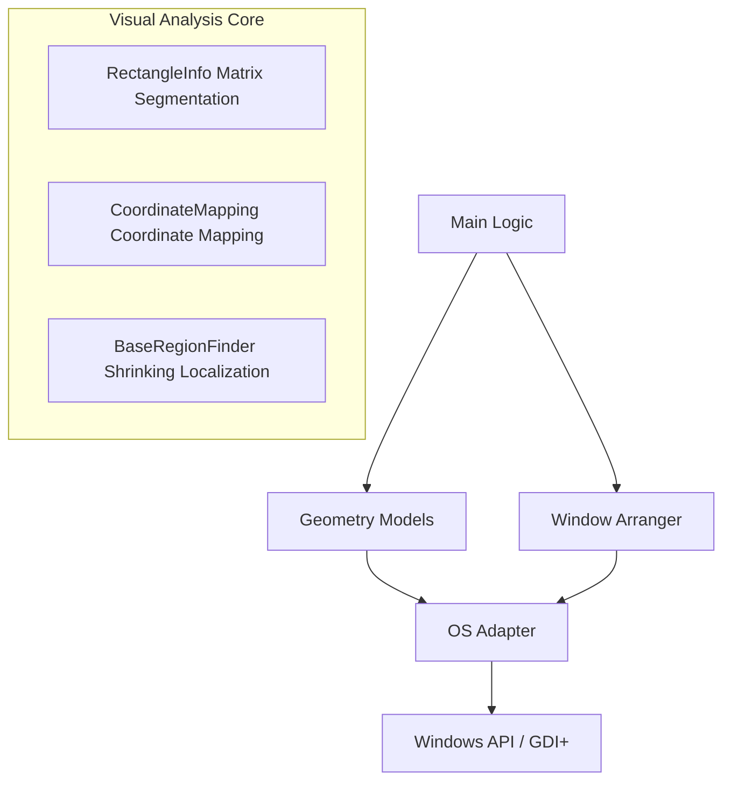

# Customized-Screenshots-OCR — High-Precision Visual Automation Engine

> **It's not OCR, nor is it a simple Clicker.**  
> This is a **high-precision visual automation engine** built on AutoHotkey v2, designed specifically for non-standard UIs, dynamic layouts, and complex business scenarios.

## 🔍 Why Is It Different?

Most automation tools rely on:
- Control IDs (unusable for games/web applications)
- Image matching (slow and fragile)
- Fixed coordinates (breaks with DPI/resolution changes)

While **Customized-Screenshots-OCR** achieves precision through:
- ✅ **Dual-driven color + geometric logic** localization
- ✅ **Row-column segmentation algorithms** for dynamic table extraction
- ✅ **GDI+ in-memory screenshot acceleration** (10x+ performance boost)
- ✅ **Multi-window independent execution** supporting complex workflows

Enabling **pixel-perfect control** of any visual interface.

## 🧩 Core Capabilities

| Capability | Description |
|------------|-------------|
| 🎯 High-Precision Visual Localization | Supports color tolerance, geometric constraints, template matching |
| 📊 Dynamic Layout Parsing | Auto-detects row-column structures and extracts variable table data |
| 🔄 Multi-Window Parallel Processing | Each window runs as independent instance, no interference |
| 🔍 Visual Debugging | Red/green/blue highlighting for candidates, targets, and error regions |
| ⚡ Performance Optimization | Uses GDI+ in-memory screenshots, eliminates per-pixel API calls |

## 📖 Project Overview

**Customized-Screenshots-OCR** is a sophisticated, modular automation solution designed to solve the automation challenge of **target applications without API interfaces**.

It goes far beyond simple "find image and click" scripts. Instead, it implements a complete, self-adaptive **visual analysis engine**. Through precise geometric calculations, multi-color logic analysis, and matrix coordinate mapping, it achieves **pixel-level precision** in locating and controlling dynamic or non-standard UI interfaces (such as game engine-rendered UIs, Qt/Electron applications).

This project demonstrates how to use **AutoHotkey v2's** object-oriented programming (OOP) features to build a robust, maintainable, production-grade automation robot.

## ✨ Core Features

- **🧩 Highly Modular Architecture**: Code is decoupled into OS adaptation layer, global configuration, window management, geometric models, and business logic for easy maintenance and extension.
- **🖥️ Multi-Window Parallel Processing**: Supports automatic discovery, arrangement, and batch processing of multiple application instances with independent visual analysis for each window.
- **🎯 Advanced Visual Localization Engine**:
  - **Matrix Coordinate Mapping**: Divides UI into logical grids, allowing target cell location even when list/table sizes change through mapping algorithms.
  - **Composite Color Logic**: Supports multi-color intersection/union operations, eliminating background interference and precisely locking data regions.
- **🛡️ Robust Bottom-Layer Encapsulation**: Built-in `OS Adapter` layer provides automatic throttling, logging, and exception handling for all system calls (mouse, pixel search).
- **🎨 Powerful Visual Debugging**: Unique `WindowColorRegion` debugging system draws semi-transparent rectangles in real-time on screen, visually demonstrating each step of algorithm computation.

## 📂 File Structure Description

The project includes different versions for different purposes. Choose based on your needs:

| Filename | Purpose | Description |
| :--- | :--- | :--- |
| **`工程版.ahk`** | **Production Environment (Recommended)** | Integrates **GDI+** in-memory acceleration technology (`DllCallPixelGetRsult`), excellent performance for large-scale scanning, suitable for 24/7 operation. |
| **`教学版.ahk`** | **Learning & Research** | Uses standard AHK commands (`PixelGetColor`) for core logic implementation with clearest code structure, ideal for learning algorithm principles. |
| **`调试版.ahk`** | **Development & Debugging** | Detailed logging (`g_logEnabled`) and behavior throttling enabled by default, for tracing system call sequences and troubleshooting localization failures. |

## 📚 Documentation

- [**Configuration Guide (Configuration)**](docs/配置指南.md): Detailed explanation of how to set up colors, window rules, and segmentation modulus.
- [**Debugging & Troubleshooting (Debugging)**](docs/调试指南.md): How to use visual tools for debugging when scripts malfunction.

## 🚀 Use Cases

This framework is particularly suitable for the following challenging scenarios, which typically cannot be solved using ControlClick or simple image search:

1. **Non-Standard UI Automation**: Target applications use custom rendering engines (such as stock trading software, industrial control software, game clients) where standard Windows control handles cannot be captured.
2. **Dynamic Layout Data Scraping (Screen Scraping)**: Need to extract data from tables with variable row counts and dynamically changing column widths.
3. **Batch Multi-Instance Operation**: Need to simultaneously control multiple emulator or application windows executing identical complex logic.

## 🛠️ Getting Started

### Prerequisites
- Windows 10/11
- [AutoHotkey v2.0+](https://www.autohotkey.com/v2/)
- **Patience and spatial geometry intuition**

### Installation & Configuration

1. **Clone the repository**:
   ```bash
   git clone https://github.com/m15154178071-cmyk/Customized-Screenshots-OCR.git
   ```

2. **Global Configuration**:
   Open the script (e.g., `工程版.ahk`) and configure targets in the **Global Config** section at the top:
   ```autohotkey
   ; Configure target program path
   global g_programConfig := Map(
       "Your Target App", ["C:\Path\To\App.exe", "Args", "AppLabel"]
   )
   
   ; Configure color features (supports RGB hexadecimal)
   global g_colorConfig := Map(
       "TargetRed", "0xFF0000",
       "TargetBlue", "0x0000FF"
   )
   ```

3. **Run the script**:
   Double-click `工程版.ahk`. The script will automatically attempt to launch/activate the target window and arrange windows according to preset logic.

## 🔍 Visual Debugging System

When localization fails or you need to develop new features, the script's powerful visual system is your best helper.

Enable debug mode by modifying the configuration `g_debugConfig["debugMode"] := true`. The script will draw on screen:
- 🔴 **Red boxes**: Rough search range
- 🔵 **Blue boxes**: Precise convergence region
- 🟢 **Green boxes**: Final confirmed click/recognition targets

## 🏗️ Architecture Overview



## 🎯 Applicable Scenarios

- Game automation/AFK farming (non-standard UI)
- Financial trading software (dynamic price tables)
- Industrial control systems (no control exposure)
- Web applications (without JavaScript support)
- Educational demonstrations / Automated testing

## 📬 Cooperation & Consultation

If you're looking for:
- Non-standard UI automation solutions
- RPA engine developers
- Visual localization experts

Contact us! (This project is open source and can provide customized services upon request)

## 🗺️ Development Roadmap

> **⚠️ Note**: The following features are future architecture evolution directions **not yet integrated in the current version**. The current script focuses on color-based visual localization and window management.

- [ ] **Integrate OCR Engine**: Connect to Umi-OCR or Tesseract to bridge from "color localization" to "text semantic understanding".
- [ ] **State Machine (FSM)**: Introduce state machine for managing complex business flows (login → task → exception → recovery).
- [ ] **GUI Configuration Tool**: Develop graphical interface to auto-generate `g_colorConfig` through "screenshot color picking", lowering configuration barriers.
- [ ] **Geometric Shape Recognition**: Add recognition algorithms for geometric features like circles and lines.

## 🤝 Contributing

We welcome issue reports and pull requests!

If you have new ideas about complex UI automation, especially suggestions regarding GDI+ performance optimization, we'd love to hear from you.

## 📄 License

MIT License.

---

**Last Updated**: 2026-02-15 12:45:46

**Repository**: https://github.com/m15154178071-cmyk/Customized-Screenshots-OCR